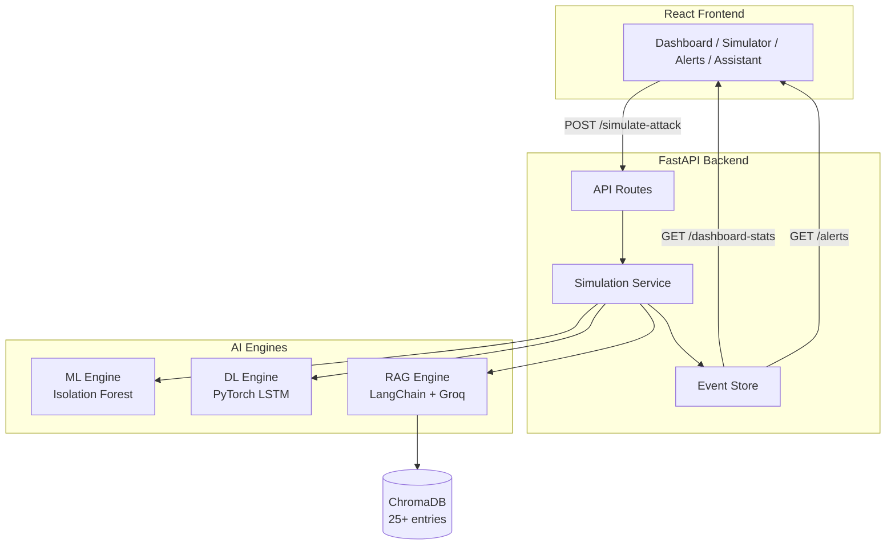

<div align="center">

# 🛡️ CyberTwin AI

**AI-Powered Cybersecurity Digital Twin Platform**

[](https://python.org)
[](https://fastapi.tiangolo.com)
[](https://reactjs.org)
[](https://pytorch.org)
[](https://langchain.com)

An end-to-end cybersecurity platform that combines **Machine Learning**, **Deep Learning**, and **Retrieval-Augmented Generation (RAG)** to simulate, detect, and mitigate cyber attacks in real-time.

</div>

---

## 🎯 Problem Statement

Modern organizations face increasingly sophisticated cyber attacks, but building and testing cybersecurity defenses requires expensive infrastructure and real attack data. **CyberTwin AI** solves this by creating a *digital twin* of a security operations center — a safe, local environment where you can:

- **Simulate** realistic cyber attacks
- **Detect** threats using dual AI engines (ML + DL)
- **Analyze** attack patterns with sequential neural networks
- **Mitigate** threats with AI-generated recommendations

---

## ✨ Features

| Feature | Description |
|---------|-------------|
| 🚨 **Attack Simulator** | One-click simulation of 4 attack types with full pipeline execution |
| 🤖 **ML Engine** | Isolation Forest anomaly detection on individual log entries |
| 🧠 **DL Engine** | LSTM neural network for sequential attack pattern recognition |
| 💬 **RAG Assistant** | ChatGPT-style cybersecurity Q&A powered by Groq LLM + ChromaDB |
| 📊 **SOC Dashboard** | Real-time risk scoring, charts, and system health monitoring |
| 🔔 **Threat Alerts** | Filterable, expandable alerts with AI mitigation recommendations |
| 📐 **Architecture View** | Visual pipeline explanation for interviews and demos |

---

## 🏗️ Architecture



### Attack Simulation Flow

```
User selects attack type
         ↓
Generate realistic fake logs
         ↓
ML Engine (Isolation Forest) → Point anomaly detection
         ↓
DL Engine (LSTM) → Sequential pattern detection
         ↓
RAG Engine → AI-generated mitigation recommendation
         ↓
Event Store → Alert + Risk Score + Activity Feed
         ↓
Dashboard updates with results
```

---

## 🚀 Supported Attack Types

| Attack | Severity | ML Detection | DL Detection | Description |
|--------|----------|-------------|--------------|-------------|
| **Brute Force** | High | ✅ High anomaly score | ✅ Sequential pattern | Repeated failed logins from single IP |
| **Credential Stuffing** | High | ✅ Multiple anomalies | ✅ Attack sequence | Stolen credentials tested across accounts |
| **Insider Threat** | Medium | ⚠️ Subtle anomaly | ⚠️ Unusual pattern | Abnormal access from internal users |
| **SQL Injection** | Critical | ✅ High anomaly score | ✅ Attack pattern | Malicious SQL payloads in inputs |

---

## 🛠️ Tech Stack

| Layer | Technology |
|-------|-----------|
| **Frontend** | React 19, Tailwind CSS 4, Recharts, Lucide Icons |
| **Backend** | FastAPI, Uvicorn, Pydantic |
| **ML Engine** | Scikit-Learn (Isolation Forest) |
| **DL Engine** | PyTorch (LSTM Neural Network) |
| **RAG Engine** | LangChain, ChromaDB, HuggingFace Embeddings |
| **LLM** | Groq API (Llama 3.1 8B Instant) |
| **Data** | Pandas, NumPy |

---

## 📦 Setup Instructions

### Prerequisites
- Python 3.10+
- Node.js 18+
- Groq API Key ([get one free](https://console.groq.com))

### Backend Setup

```bash
cd backend
python -m venv venv

# Windows
.\venv\Scripts\activate
# macOS/Linux
source venv/bin/activate

pip install -r requirements.txt
python scripts/generate_data.py
```

Create `backend/app/.env`:
```
GROQ_API_KEY=your_groq_api_key_here
```

Start the server:
```bash
uvicorn app.main:app --reload
```

### Frontend Setup

```bash
cd frontend
npm install
npm run dev
```

Open `http://localhost:5173` in your browser.

---

## 📡 API Endpoints

| Method | Endpoint | Description |
|--------|----------|-------------|
| `POST` | `/api/v1/simulate-attack` | Trigger full attack simulation pipeline |
| `GET` | `/api/v1/dashboard-stats` | Dashboard statistics and metrics |
| `GET` | `/api/v1/activity-feed` | Live activity feed events |
| `GET` | `/api/v1/alerts` | Threat alerts (filterable by severity/type) |
| `GET` | `/api/v1/risk-score` | Current risk score and level |
| `GET` | `/api/v1/system-status` | System health check |
| `GET` | `/api/v1/attack-types` | Available attack type metadata |
| `POST` | `/api/v1/security-assistant` | RAG chatbot query |
| `GET` | `/api/v1/threat-detection` | Single ML detection (legacy) |
| `GET` | `/api/v1/dl-threat-analysis` | Single DL analysis (legacy) |

---

## 🧠 AI/ML Explanation

### Isolation Forest (ML Engine)
- **Type**: Unsupervised anomaly detection
- **Input**: `[failed_attempts, login_success]` per log entry
- **Output**: Normal (1) or Anomaly (-1)
- **Why**: Efficiently detects point anomalies — individual log entries that deviate from normal patterns

### LSTM Network (DL Engine)
- **Type**: Supervised sequence classification
- **Input**: Sliding window of 5 consecutive log entries
- **Output**: Normal pattern vs. Attack pattern + confidence score
- **Why**: Captures temporal dependencies — detects attacks that unfold over multiple events

### RAG (Security Assistant)
- **Knowledge Base**: 25+ cybersecurity entries covering OWASP Top 10, MITRE ATT&CK, NIST Framework, CVEs
- **Embeddings**: HuggingFace `all-MiniLM-L6-v2`
- **Vector Store**: ChromaDB (in-memory)
- **LLM**: Groq Llama 3.1 8B Instant
- **Why**: Combines retrieval accuracy with generative fluency for actionable recommendations

---

## 🐳 Docker Setup

```bash
docker-compose up --build
```

---

## 🔮 Future Enhancements

- [ ] Real-time log streaming via WebSockets
- [ ] User authentication and role-based access
- [ ] Persistent database for alert history
- [ ] Additional attack types (ransomware, phishing, DDoS)
- [ ] Model retraining pipeline
- [ ] SIEM integration (Splunk/ELK connector)
- [ ] Automated incident response playbooks

---

## 📄 License

This project is for educational and portfolio purposes.

---

<div align="center">

Built with ❤️ for cybersecurity

</div>